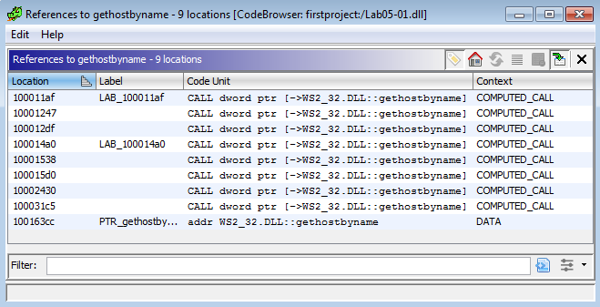
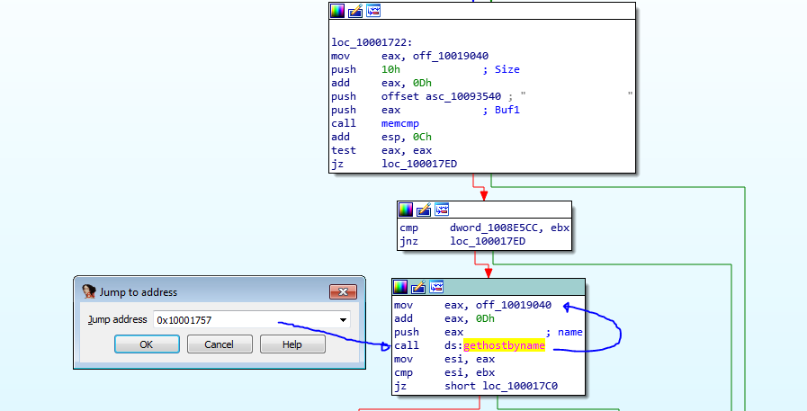
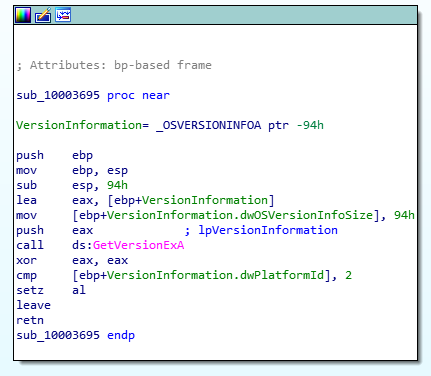
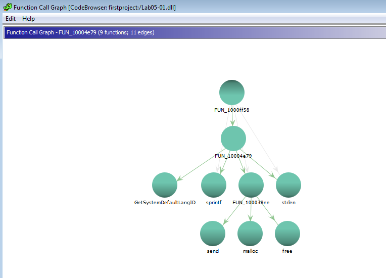
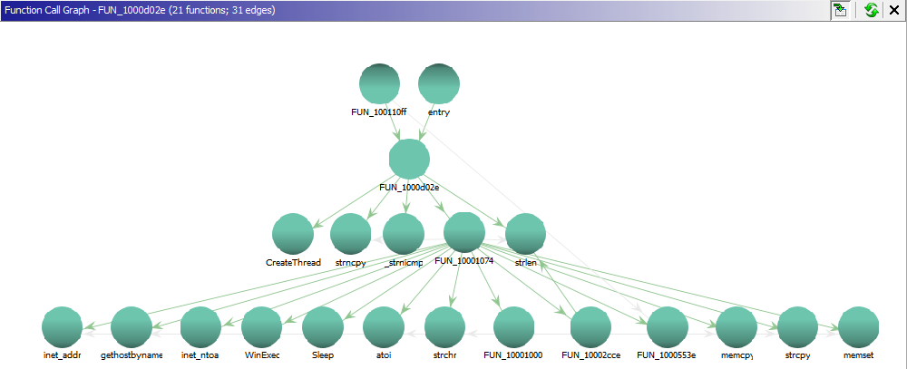
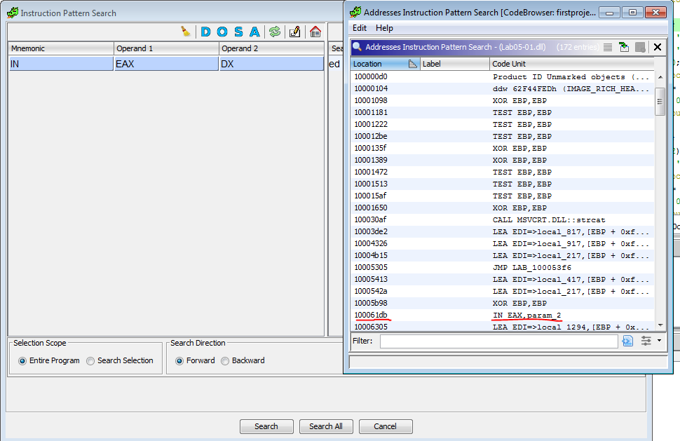
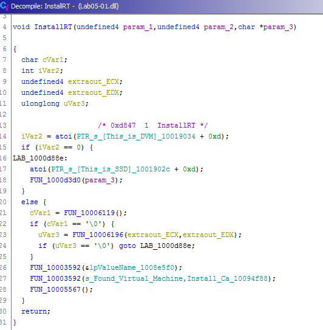
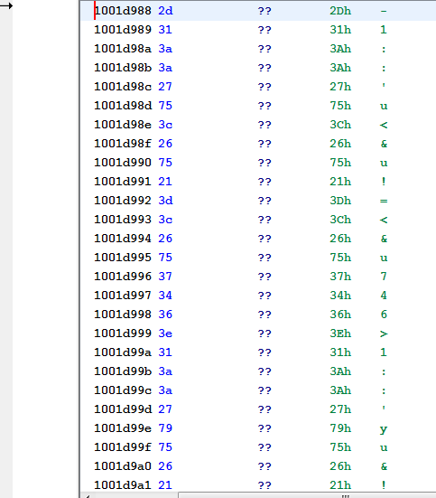

# Advanced Static Techniques - IDA Pro and Ghidra

This chapter is about learning the powerful tool called IDA Pro. Unfortunately, this tool requires an expensive license, so I will try to apply all the content from the book  into Ghidra. 

In [My Awesome List](https://pabdj.github.io/posts/my-awesome-list/) there are multiple pointers to interesting tricks and tips to enhance Ghidra. Apart from that, in [Create your own malware analysis lab - Upgrading FLARE VM](https://pabdj.github.io/posts/create-your-own-malware-analysis-lab/#upgrading-flare-vm) there is a link to several scripts that are thought to provide a similar experience to IDA Pro.

## Notes
- Differences between loading the file with PE format or as a raw binary.
- PE files are compiled to load at a preferred base address in memory, and if the Windows loader can’t load it at its preferred address (because the address is already taken), the loader will perform an operation known as rebasing. This most often happens with DLLs, since they are often loaded at locations that differ from their preferred address.
- By default, IDA Pro **does not include** the PE header or the resource sections in its disassembly

### The IDA Pro Interface
- Select ``Options ▶ General``, and then select ``Line prefixes`` and set the ``Number of Opcode Bytes`` to 6.
- If you are still learning assembly code, you should find the auto comments feature of IDA Pro useful. To turn on this feature, select ``Options ▶ General``, and then check the ``Auto comments`` checkbox.
- Functions window. This window also associates flags with each function (F, L, S, and so on), the most useful of which, L, indicates library functions. The L flag can save you time during analysis, because you can identify and skip these compiler-generated functions.
- Navigation bar colours: light blue is library code as recognized by FLIRT, red is compiler-generated code and dark blue is user-written code.
- To add your own comments, place the cursor on a line of disassembly and press the colon (:) key on your keyboard to bring up a comment window. To insert a repeatable comment to be echoed across the disassembly window whenever there is a cross-reference to the address in which you added the comment, press the semicolon (;) key.

### Ghidra Modifications
- When loading the file, select `WindowsPE x86 Propagate External Parameters`. This option will populate function arguments in the comments. We will also check the box that says `Decompiler Parameter ID`.
- **Listing Display:** Increase the font size and enable bold formatting for easier reading.
- **Listing Fields >> Bytes Field:** Change ``Maximum Lines to Display`` to 1 to simplify spacing between lines of assembly code.
- **Listing Fields >> Cursor Text Highlight:** Change ``Mouse Button to Activate`` to ``LEFT``. This will highlight all instances of the selected text when the left mouse button is clicked (similar to other disassemblers).
- **Listing Fields >> EOL Comments Field:** Check ``Show Semicolon at Start of Each Line`` to better separate the assembly text from inserted comments.
- **Listing Fields >> Operands Field:** Check ``Add Space After Separator`` for improved text readability.

#### References:
- [Code Analysis With Ghidra: An Introduction - The BlackBerry Cylance Threat Research Team](https://blogs.blackberry.com/en/2019/07/an-introduction-to-code-analysis-with-ghidra)

## Labs

### Lab 1
**1. What is the address of DllMain?**

It was a bit frustrating to see how Ghidra still underperformed IDA even with the free version. IDA perfectly showed the different functions meanwhile Ghidra struggled to name most of them.
Anyway, the address of *DllMain* is 0x1000D02E.

**2. Use the Imports window to browse to *gethostbyname*. Where is the import located?**

The import is located at 0x100163CC. Fortunately, we could answer this question easily by filtering the function name in the imports windows.

**3. How many functions call *gethostbyname*?**

From the picture attached to the previous answer we can observe in green 8 cross-references from other functions, but we have to be careful because it is not counting the declaration of that function. In order to be sure, right click WS2_32.DLL and click References ▶ Show references to *gethostbyname*.

After taking into consideration this, we can observe that there are **9** functions that call *gethostbyname*.

**4. Focusing on the call to gethostbyname located at 0x10001757, can you figure out which DNS request will be made?**

After landing at 0x10001757, we can observe that previously an offset has been moved to *eax* register. After clicking on it, we are moved to the corresponding string, and we see that the URL is "pics[.]practicalmalwareanalysis[.]com"

**5. How many local variables has IDA Pro recognized for the subroutine at 0x10001656?**

It has recognized 23 local variables

**6. How many parameters has IDA Pro recognized for the subroutine at 0x10001656?**

In the previous image we can observe that *lpThreadParameter* has been recognized as the parameter of the subroutine.

**7. Use the Strings window to locate the string *\cmd.exe /c* in the disassembly. Where is it located?**

It is located at 0x10095B34.

**8. What is happening in the area of code that references *cmd.exe /c*?**

It starts a session with the C2C server.

**9. In the same area, at 0x100101C8, it looks like dword_1008E5C4 is a global variable that helps decide which path to take. How does the malware set dword_1008E5C4? (Hint: Use dword_1008E5C4’s cross-references.)**

First of all, we go to 0x100101C8 address.

After clicking on dword_1008E5C4, we observe two cross-references to this variable.

The first subroutine, which is the interesting one shows that the value of the variable is set after calling subroutine_10003695. This function retrieves the Windows version so that the malware knows if the target is correct.

|     sub_10001656      |     sub_10003695      |
|:---------------------:|:---------------------:|
|  |  |

**10. A few hundred lines into the subroutine at 0x1000FF58, a series of comparisons use memcmp to compare strings. What happens if the string comparison to *robotwork* is successful (when *memcmp* returns 0)?**

It calls subroutine 0x100052A2 that checks some values in the registry entry (*HKLM/SOFTWARE/Microsoft/Windows/CurrentVersion/WorkTime* and *WorkTimes*)

**11. What does the export ``PSLIST`` do?**

It returns a list of the processes that have been created after calling *CreateToolhelp32Snapshot*.

**12. Use the graph mode to graph the cross-references from sub_10004E79. Which API functions could be called by entering this function? Based on the API functions alone, what could you rename this function?**

The function calls [*GetSystemDefaultLangID*](https://learn.microsoft.com/en-us/windows/win32/api/winnls/nf-winnls-getsystemdefaultlangid) that returns the language identifier for the system locale. This is the language used when displaying text in programs that do not support Unicode.
After that, it calls subroutine 0x100038EE that sends the information through the socket.
We could rename the function to *GetSystemLanguage*.

**13. How many Windows API functions does DllMain call directly? How many at a depth of 2?**

DllMain (function 0x1000D02E) calls directly *CreateThread*, *strncpy*, *function 0x10001074* and strlen.
At depth 2 we observe the API functions called by *function 0x10001074*.

**14. At 0x10001358, there is a call to Sleep (an API function that takes one parameter containing the number of milliseconds to sleep). Looking backward through the code, how long will the program sleep if this code executes?**

Sleep takes as a parameter the value in *iVar1*. As we can see, *atoi* function is called and converts the value given from a string to an integer. We also have to take into account that there is an offset (0xD = 13 in decimal) that removes the first part of the buffer *[This_is_CTI]*. This way, we only keep 30 seconds as a parameter.

**15. At 0x10001701 is a call to socket. What are the three parameters?**
**16. Using the MSDN page for socket and the named symbolic constants functionality in IDA Pro, can you make the parameters more meaningful? What are the parameters after you apply changes?**

The three parameters are AF (2 = AF_INET aka IPv4), type (1 = SOCK_STREAM aka TCP) and protocol (6 = IPPROTO_TCP). 

**17. Search for usage of the `in` instruction (opcode 0xED). This instruction is used with a magic string VMXh to perform VMware detection. Is that in use in this malware? Using the cross-references to the function that executes the in instruction, is there further evidence of VMware detection?**

In Ghidra we click `Search` → `InstructionPattern` and  `Enter Bytes Manually` where we insert ED (input mode HEX).

Once we have found the function that uses this instruction we search for cross-references of this function.

As we can observe in the decompile window, there are signs of anti-virtualization techniques.

**18. Jump your cursor to 0x1001D988. What do you find?**

There are a bunch of characters that do not seem to express anything coherent.

**19. If you have the IDA Python plug-in installed (included with the commercial version of IDA Pro), run Lab05-01.py, an IDA Pro Python script provided with the malware for this book. (Make sure the cursor is at 0x1001D988.) What happens after you run the script?**
**20. With the cursor in the same location, how do you turn this data into a single ASCII string?**

As I am not working with IDA Pro I am not able to answer these questions.

**21. Open the script with a text editor. How does it work?**

It seems to XOR a range of bytes in order to decode some part of the code.